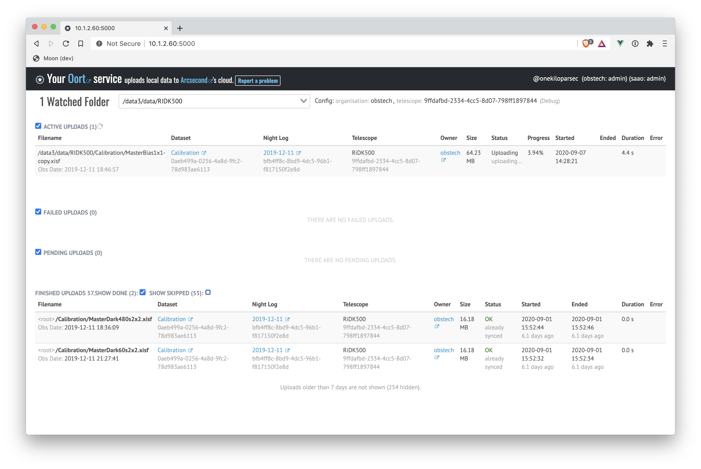

# Welcome to the Oort Documentation

Oort is the open-source super-easy-to-use tool for automatically and continuously uploading to [Arcsecond.io](https://www.arcsecond.io)
files that are inside a folder.

[Arcsecond.io](https://www.arcsecond.io) is a comprehensive cloud platform for astronomical observations, for individual astronomers, collaborations
and observatories.

Cloud storage backend is [Amazon's S3](https://aws.amazon.com/s3/), and Oort has been thoroughly tested on recent Linux and macOS operating systems
(it may need some tweaks on Windows).

**Oort is a pure push up tool, not a two-ways syncing tool.** A file that is deleted locally will remain in the cloud if already uploaded. Change of
files in the cloud have no effect locally either. Oort works in the background, in batch mode. When one or more folders started to be "watched", any
new file inside them is sent to the cloud.

Oort can be used by an observatory, to store data specifically for that organisation. For that, the organisation must have been registered first, and
subdomain defined. See also the `--organisation` option below. Or by individual astronomers who want to store data in a cloud dedicated to astronomical
data.

[Contact us](mailto:team@arcsecond.io). We would be happy to open a portal for you to see and try to upload data.

Oort comes with a small local web server to monitor the uploader, and this is what it looks like when running:

(<a href="https://arcsecond-io.github.io/oort/assets/oort-screenshot-uploading.png">enlarge</a>)

## Installation & Update

Use pip (see [this page](https://pip.pypa.io/en/stable/installing/) on how to install pip, if you haven't done so):

```bash
$ pip install oort-cloud
```

Install for the user only (non-root):

```bash
$ pip install oort-cloud --user
```

Upgrade oort-cloud:

```bash
$ pip install oort-cloud --upgrade
```

Note that a PyPi package named `oort` (without the `-cloud`) already exists (unfortunately), and has nothing to do with our case. The CLI commands
below nonetheless start with `oort` only.

## Direct mode

Oort can be used in a pure "upload this folder right now, please", a.k.a "direct" mode. It is suited for cases where a folder contains existing files
of data, and the content of the folder won;'t change over time. (Note that, if it does, the command can be safely re-run).

Here are the commands (the first one is to login to Arcsecond.io if not yet done):

```bash
oort login
oort upload [OPTIONS] folder
```

The `OPTIONS` part of `oort watch` is important. There are three options:

* `-o <subdomain>` (or `--organisation <subdomain>`) to specify that uploads of that folder will be sent to that organisation.
* `-t <telescope uuid>` (or `--telescope <telescope uuid>`) to specify which telescope has been used. This option is mandatory for uploads to an
  organisation, and optional for uploads to a personal account.
* `-f` (or `--force`) to force the re-upload of the folder's content. As always, existing files in the cloud will never be modified or overwritten.
  Simply, Oort will reset the local metadata it keeps for every upload, and start over.

Oort will summarise the settings associated with the folder, and ask for confirmation before proceeding.

**All non-hidden files will be uploaded.** And data files can be compressed automatically before upload. See below for details.

## Batch / background mode

Oort batch mode works by watching for files in a folder, and automatically upload them to the cloud in the background. This mode is designed for "live
mode" where data files are being sent to a folder, during the night. Hence the content of the folder changes over time.

Oort has an almost-no-step-3 usage (the first one is to login to Arcsecond.io if not yet done):

```bash
oort login
oort restart
oort watch [OPTIONS] folder1 folder2 ...
```

The `OPTIONS` part of `oort watch` is important. There are three options:

* `-o <subdomain>` (or `--organisation <subdomain>`) to specify that uploads of that folder will be sent to that organisation.
* `-t <telescope uuid>` (or `--telescope <telescope uuid>`) to specify which telescope has been used. This option is mandatory for uploads to an
  organisation, and optional for uploads to a personal account.
* `-z` (or `--zip`) to automatically gzip data files (FITS and XISF, other files aren't touched) before upload. Default is False. Note that switching
  zip on will modify the content of the folder (replacing files with zipped ones), hence impacting a possible backup system. Moreover, zipping will
  require some CPU resource.

Oort will summarise the settings associated with the new watched folder, and ask for confirmation before proceeding.

**All non-hidden files will be uploaded.** And data files can be compressed automatically before upload. See below for details.

### How does the batch mode work?

Oort-Cloud works by managing 2 processes:

• A **batch-uploader**, which takes care of creating/syncing the Datasets and Datafiles objects in Arcsecond.io (either in your personal account, or
your Organisation). And then upload the files.

• A **monitor-server** (small local web server), which allow you to observe, control and setup what is happening in the uploader (and find what
happened before too).

These processes are **managed** (by a small `supervisord` daemon), that is, they are automatically restarted if they crash.

### Why 0.0.0.0:5000 ?

The little web server that Oort starts locally has the address <code>http://0.0.0.0:5000 </code>. With such IP address, the oort processes can run in
the PC where data is sent to, and still being monitored from a remote PC without login. Say for instance the PC that receives all the data is PC42 and
you work on PC17. Oort watch command has been issued on PC42. From PC17 you can monitor what happens on PC42 by simply visiting
<code>http://&lt;ip address of pc42&gt;:5000 </code>.

### All batch mode commands

* `oort start`, to start the batch-uploader and the monitor-server.
* `oort stop` to stop the batch-uploader and the monitor-server
* `oort restart`, in case you need a full reconfiguration and restart.
* `oort status` to check the status of the two processes.
* `oort logs` to read the latest batch-uploader logs in the terminal.
* `oort open` to open the monitor web server in the default browser

## Other commands

* `oort folders` to display a list of the folders watched in background.
* `oort telescopes` to get a list of telescopes available.
* `oort login` to login to Arcsecond.io first.
* `oort` or `oort --help` for a complete help.

All commands have dedicated help accessible with `oort <command> --help`

There is no need of using `sudo` in any case with oort.

## File extensions

All non-hidden files found in the watch folder or one of its subfolder will be uploaded. Files can have an extension or not (for instance `README`
files will also be uploaded).
**Hidden files starting with a dot will not be uploaded.**

As for the data, **Oort support XISF and FITS files, zipped or not.**
Oort will accept files with the following FITS filename extensions:
`.fits`, `.fit`, `.fts`, `.ft`, `.mt`, `.imfits`, `.imfit`, `.uvfits`,
`.uvfit`, `.pha`, `.rmf`, `.arf`, `.rsp`, `.pi`
as well as `.xisf` ones.

Moreover, these extensions can be augmented with the following zipped file extensions: `.zip`, `.gz`, `.bz2`

## File compression

Files to be uploaded can be already compressed or not. Oort is able to deal with any of them transparently.

If a XISF or FITS file is being detected and the zip option is set (in the `watch` command), it will be zipped (with standard)
`gzip` compression before being uploaded. The compression is made locally just beside the original file, which will be deleting once zip is done (as
would a normal `gzip` command do in the terminal).

**Oort includes an interruption handler that will stop any zip process running**, would any problem occurs preventing the process to complete. More
precisely it will stop zip processes on `SIGINT`, `SIGQUIT` and `SIGTERM`.

Of course, if the folder is read-only for its user, no zipping will be made.

## Folder structure and Data organisation

Oort is using the folder structure to infer organisation of files inside datasets. And there is one simple rule to know: **1 folder (or subfolder) = 1
dataset**. The rule is voluntarily simple to make Oort focused and reliable. Subsequent re-organisation, renaming etc will occur on the backend.

## Additional things you must be aware of

* There is no need to install or run Oort as `root`.
* One must login first before uploading, with the command `oort login`. It will locally store the necessary credentials used for uploading. **Keep
  these credentials safe**.
* Note that `oort login` fetches a limited-scope upload key, just enough to perform its task.
* If uploading for an organisation, Oort must necessarily be run by a member of it (quite obviously).
* This tool is open-source obviously to let anyone it doesn't send or use data that has not explicitly marked for uploading. It is also open for
  modification, or improvement. Please, use the standard GitHub pull-request mechanism.
* The only auxiliary data that is collected and attached as tag of the files and datasets are the machine hostname (the output of the `uname -n`
  command). See inside `oort/uploader/engine/preparator.py` and `uploader.py` for the line `socket.gethostname()`.
